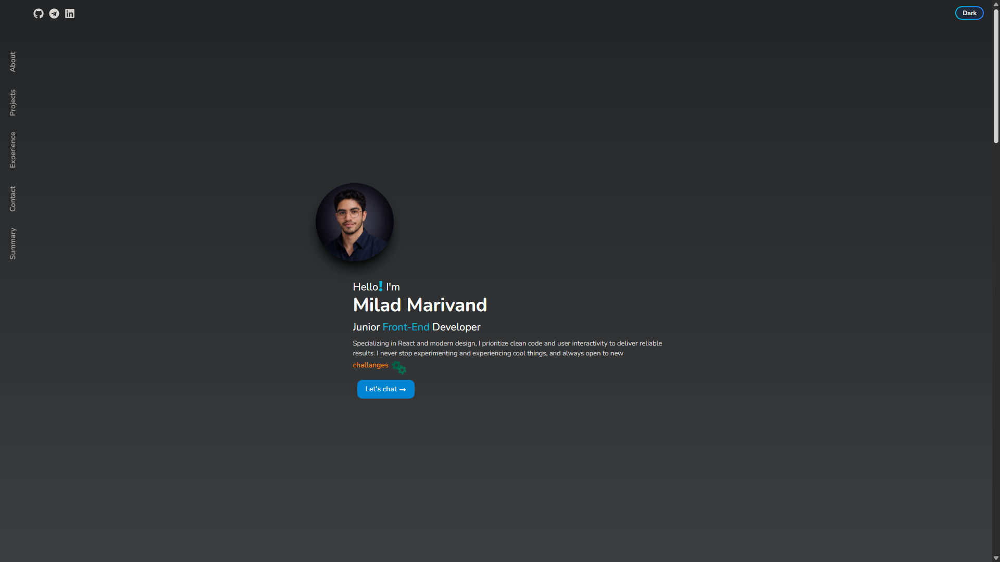

# Milad Marivand — Front-End Portfolio

This is my personal portfolio website where I showcase my projects, skills, and development journey.  
It is built with a focus on clean structure, clarity, and smooth user experience.

The portfolio highlights my front-end work, learning approach, and the way I think about building interfaces.

## Preview




## Demo Version

Click on the link to navigate to live demo deployed on Vercel

[View Live Demo](https://portfolio-48rm9my7j-pixedit-1760s-projects.vercel.app/)

## Tech Stack

- Front-End: React ^19.2.0, JavaScript
- Routing: React Router Dom
- Styling: Tailwind CSS
- Animation: Framer Motion
- Bundler: Vite
- Icons: React Icons
- Deployment: Vercel

## Features

- Project showcase with detailed project pages
- Clean and responsive layout across devices
- Dark / Light mode toggle
- Smooth UI animations
- Contact section with direct links

## What This Project Demonstrates

- Component-based architecture in React
- Data-driven UI rendering
- Client-side routing with React Router
- Responsive design using Tailwind CSS
- UI motion and transitions with Framer Motion

## Getting Started

### Prerequisites

- **Node.js**: v24.11.1 or higher
- **npm** or **yarn**

#### Installation & Local Development:

```bash
git clone https://github.com/pixedit-dev/portfolio.git
cd portfolio
```

#### Install dependencies

```bash
npm install
```

#### Or

```bash
yarn install
```

#### Start the development server

```bash
npm run dev
```

## Author

Developed by Milad — Front-End Developer

[GitHub](https://github.com/pixedit-dev)

[LinkedIn](https://www.linkedin.com/in/milad-marivand-89b2033a1/)
